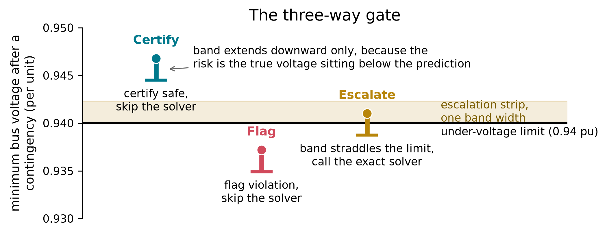

# Conformal-gated N-1 contingency screener

This repository contains the code, data, and figures for a conformal-gated N-1 contingency
screener for power grids. For each single-branch outage, an exact AC power-flow solve is the
ground truth; a fast surrogate predicts the post-outage minimum bus voltage, a one-sided
split-conformal band wraps the prediction, and a three-way gate (certify / flag / escalate)
decides which cases still need the exact solver. The primary network is IEEE 118-bus
(`pandapower.networks.case118`); an out-of-sample check is run on IEEE 30-bus (`case30`).



## Repository layout

### `feasibility/`

- `generate_dataset.py`: the N-1 scenario generator. Samples a load/generator-setpoint/reactive
  scenario, requires the N-0 base case to converge and clear the 0.94 pu floor (the feasibility
  gate), then solves every branch outage.
- `gonogo.py`, `straddle.py`, `analysis.py`: the two original feasibility studies (a loading-ceiling
  sweep and a per-bus straddle census) and their reporting, run before the diversified generator
  existed.
- `experiment_2x2.py`, `ablation.py`, `tune_sweep.py`: the controlled sampling x oracle experiment,
  per-axis attribution, and the load-ceiling tuning sweep that set the generator's committed
  sampling window.
- `make_splits.py`: scenario-grouped train/calibration/test splitting (`GroupShuffleSplit` on
  `scenario_id`, so no scenario's contingencies cross a split) and feature selection.
- `measure_solve.py`: times the pinned AC solver (minimum over 400 timed solves after warm-up).
- `surrogate.py`, `gate_eval.py`: the surrogate models (persistence, train-mean, ridge, histgb) and
  the one-sided conformal calibration + three-way gate.
- `run_all.py`: evaluates all four models against the gate over 5 seeds.
- `tradeoff.py`, `safety_table.py`, `paper_hero.py`: the coverage sweep and its safety-operating-point
  / hero-figure derivatives.
- `freeze_poster_numbers.py`: collects the headline numbers into a single frozen JSON.
- `domain_figure.py`, `gate_schematic.py`, `boundary_mass_hist.py`, `pipeline_schematic.py`,
  `network_anatomy_figure.py`, `poster_table1.py`, `figtools.py`: the explanatory figures and
  shared plotting helpers.
- `case57_gonogo.py`, `probe_alt_networks.py`, `quintile_boundary_mass.py`, `probe_clip_0_94.py`,
  `probe_redraws.py`: second-network go/no-go probes and diagnostics of a generator-setpoint
  clipping artifact and its fix.
- `test_*.py`: guard tests over the dataset, manifests, pipeline, and tradeoff curve.
- `manifest.py`: the manifest writer attached to every artifact (package versions, solver config,
  git commit, content hash).
- `analyze_broadened.py`, `broadened_diversity.png`, `experiment_2x2.png`, `tune_sweep_hist.png`:
  supporting analysis and figures for the sampling-diversification study.

### `scripts/`

- `classical_manifest.py`: the `scripts/` counterpart of `feasibility/manifest.py`.
- `classical_screen.py`, `run_classical.py`, `eval_classical.py`: a classical first-order
  voltage-sensitivity baseline (one base-case Jacobian factorization per scenario, applied per
  outage) and its evaluation against the same gate code as the surrogate.
- `build_comparison.py`, `plot_comparison.py`: merge a conformal tradeoff curve with the classical
  metrics into a Pareto-dominance comparison and render it.
- `tune_surrogates.py`, `eval_tuned.py`, `build_v2_frozen.py`, `emit_v2_tables.py`: the gate-aware
  (M2) hyperparameter search, confined to the train split, and its promotion to a v2 tradeoff curve
  and frozen numbers.
- `bus_convention_map.py`, `apply_bus_conversion.py`: pandapower-index-to-IEEE-bus-name convention
  audit and the one-off migration that applied it.
- `emit_table_bodies.py`: emits LaTeX table bodies from the committed metrics.
- `missed_depth.py`, `miss_depth_fig.py`, `miss_tail_counts.py`, `deepest_miss_case.py`,
  `miss_mechanism.py`, `qlims_off_check.py`, `pin_tail_config.py`, `escalation_at_095.py`:
  miss-depth stratification of the promoted (v2) gate's missed violations and the physical
  mechanism behind the deepest certified miss.
- `case30_gate.py`: the case30 gate run. It tunes M2 configs, predicts escalation from
  calibration-only data before touching the test split, then evaluates on the held-out test split.
- `check_paper.py`: a mechanical consistency checker that traces every numeric literal in the paper
  to a committed data artifact.

### `data/`

- `dataset.parquet` (**not committed**; see `.gitignore`). Regenerate it with the command below.
- `splits.json`, `solve_time.json`: scenario splits and pinned-solver timing.
- `screener_metrics.json`, `tradeoff_curve.json`, `tradeoff_curve_v2.json`: per-seed baseline/gate
  metrics and the coverage sweep, for the committed (M1) and promoted (M2) surrogates.
- `frozen_poster_numbers.json`, `frozen_poster_numbers_v2.json`: the frozen headline numbers for the
  committed and promoted models.
- `classical_*.json`, `comparison_curve*.json`: the classical sensitivity-screen baseline and its
  comparison against the conformal gate.
- `tuning_search.json`, `tuned_metrics.json`, `tuned_frontier.json`: the M2 hyperparameter search
  log, its test-split evaluation, and the matched-missed-rate frontier.
- `missed_depth.json`, `miss_*.json`, `deepest_miss_case.json`, `qlims_off_check.json`: miss-depth
  stratification and the mechanism analysis of the deepest certified miss.
- `case30_*.json`, `case57_feasibility.json`, `probe_alt_networks.json`: the case30 gate run and the
  go/no-go probes that selected it over case57.
- `*.png`: the committed figures (gate schematic, boundary-mass histogram, tradeoff curves,
  network/pipeline diagrams, classical-vs-conformal comparison).
- every `*.manifest.json`: a sidecar for its artifact, recording package versions, solver config,
  git commit, and a content hash.

## Reproducing the results

`data/*.parquet` is not committed. Regenerate the dataset first. Most commands below read from it
directly or through a downstream JSON; two also read files that are already committed rather than
regenerated by this list: `freeze_poster_numbers.py` reads `data/experiment_2x2.json`, and
`domain_figure.py` / `network_anatomy_figure.py` read `data/bus_layout.json`.

```
.venv/bin/python feasibility/generate_dataset.py --n 1500 --mult-lo 1.0 --mult-hi 1.12 \
    --reg-lo 1.0 --reg-hi 1.12 --pf-lo 0.9 --pf-hi 1.15 --dvm 0.025
.venv/bin/python feasibility/make_splits.py
.venv/bin/python feasibility/measure_solve.py
.venv/bin/python feasibility/run_all.py
.venv/bin/python feasibility/tradeoff.py
.venv/bin/python feasibility/safety_table.py
.venv/bin/python feasibility/freeze_poster_numbers.py
.venv/bin/python feasibility/domain_figure.py
.venv/bin/python feasibility/gate_schematic.py
.venv/bin/python feasibility/boundary_mass_hist.py
.venv/bin/python feasibility/pipeline_schematic.py
.venv/bin/python feasibility/network_anatomy_figure.py
.venv/bin/python feasibility/paper_hero.py
```

The flags on `generate_dataset.py` are the committed sampling configuration (mirrored in
`feasibility/case57_gonogo.py`'s `COMMITTED_CFG`); the exact `--seed` used for the committed
dataset is not recorded in any tracked artifact, so this reproduces the same sampling
configuration and scenario count (1,500 N-0-feasible scenarios), not necessarily a byte-identical
file. `--n`, `--mult-hi`, `--out`, `--nproc`, and `--seed` default to `50`, `1.12`,
`data/dataset.parquet`, `1`, and `1` respectively if omitted; see `feasibility/generate_dataset.py`
for the rest.

The classical baseline (`scripts/run_classical.py` -> `eval_classical.py` -> `build_comparison.py`
-> `plot_comparison.py`), the M2 hyperparameter search and promotion (`scripts/tune_surrogates.py`
-> `eval_tuned.py` -> `build_v2_frozen.py`), the miss-depth/mechanism analysis, and the case30 gate
run (`scripts/case30_gate.py`) are extensions of this pipeline; each script's inputs and outputs
are listed in the file manifest above.

## Environment

Pinned dependency versions are in `requirements.txt`; install with `pip install -r requirements.txt`.

## Citation

The paper is unpublished. This work was carried out in the Boston University RISE Data Science
Practicum, 2026. A citation will be added on publication.
